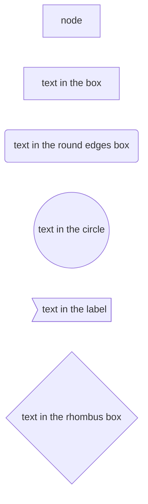
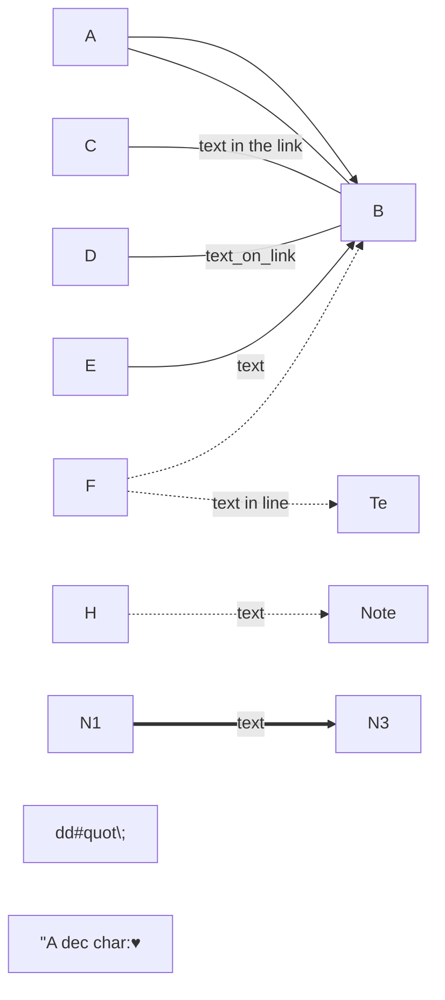

不用点点点,编写一些代码，生成想要的流程图，可以提高工作效率。应该修改代码的效率，远远要高于鼠标点点点。

### 流程图 flowcharts

* graph方向类型

	* TB  - top bottom  从上到下 TD和TB一样
	* BT  - bottom top  从下到上
	* RL  - right left  从右到左
	* LR  - left right  从左到右

* node 节点类型


* link 线条类型

	<>左右箭头，|text|在link上加文字， \-\-\- 实线，=== 粗线，  \-.\-点线
	* A \-\-> B	带箭头的线条
	* A \-\-\- B	不带箭头，实线
	* C \-\-text in the link \-\-\- B	线条上的文字
	* D \-\-\-\|text on the link\| B	带文字的线条，同上
	* E \-\- text onlink arrow \-\-> B	带箭头的线条，同时线条上有文字
	* E \-\-\->\|text on linkarrwo\|B	同上
	* F \-.\-> B	点线带箭头
	* F \-.\- B	点线,不带箭头
	* F \-.\-\|text\|Note
	* F \-.text.\-Note
	* N1 ==> N2	粗线
	* N3 ==>\|text\|N4

* 特殊字符
	* 如果想输出特殊字符，比如( [ 等, 要用**双引号**
	* Node["this is (txxt)"]  用双引号把内容包起来，这样就能输出括号等特殊字符了。
	* 同时双引号内的html实体会被转义输出,如#quot;会转义为" #9829;会转义为一个心形


* subgraphs 子图

```
	subgraph title
		graph definition
	end
```
子图demo

	graph TB
		c1-->a2
		subgraph one
		a1-->a2
		end
		subgraph two
		b1-->b2
		end
		subgraph three
		c1-->c2
		end

