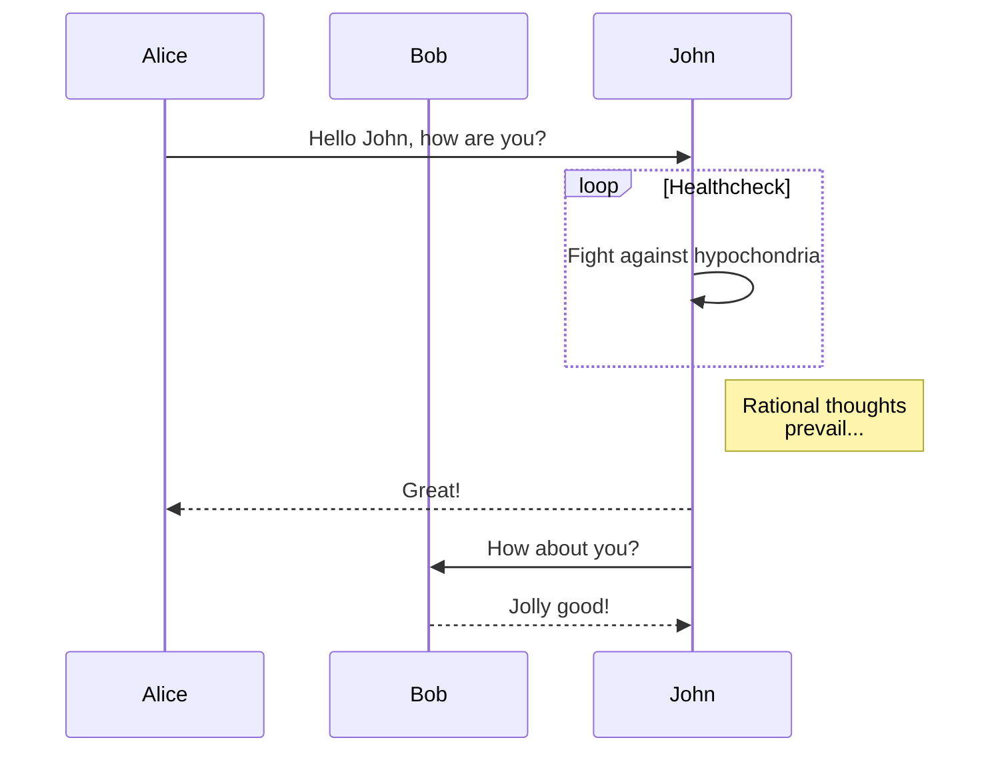

vim下有很多支持markdown文件预览的插件。今天找到了一个很简单而且功能相对强大的vim插件previm。
是一个日本开发者的开源项目(https://github.com/previm/previm/blob/master/README-en.mkd)
需要依赖的library和插件很少。准确说预览reStructuredText文档需要rst2html的一个python工具外。

### 安装previme

* 先安装依赖

		pip install docutils  ## python2.7
		rst2html --version    ## reStructuredText文档需要这个rst2html工具
* 修改~/.vimrc文件(我用的是vundle管理vim插件), 关于vim插件管理，我先在这里挖个坑，以后再填上

		call vundle#begin()

		......

		Plugin 'previm/previm'  " 添加到vundle的调用之间

		......

		call vundle#end()
			
		......
				
		let g:previm_open_cmd = 'google-chrome -a' " 用chrome预览
		" let g:previm_open_cmd = 'firefox -a'  " 用firefox预览
		" 为了避免.md被理解为modula2文件，添加以下说明
		augroup PrevimSettings
			autocmd!
			autocmd BufNewFile,BufRead *.{md,mdwn,mkd,mkdn,mark*} set filetype=markdown
		augroup END

* 一点小改动

		文档上的previm_open_cmd不合适，需要改成如上
		:h g:previm_open_cmd 
        # open by FireFox
		let g:previm_open_cmd = 'open -a Firefox'
        # open with Google Chrome
        let g:previm_open_cmd = 'open -a Google\ Chrome'

### 使用
	
* 编辑一个md文档，需要预览文件时，输入:PrevimOpen 打开浏览器预览
* 修改文件后，预览文件会动态更新

* 对mermaid的支持

* reStructuredText，编辑后，:PreviewOpen

### 预览效果图

<figure>
	
</figure>

