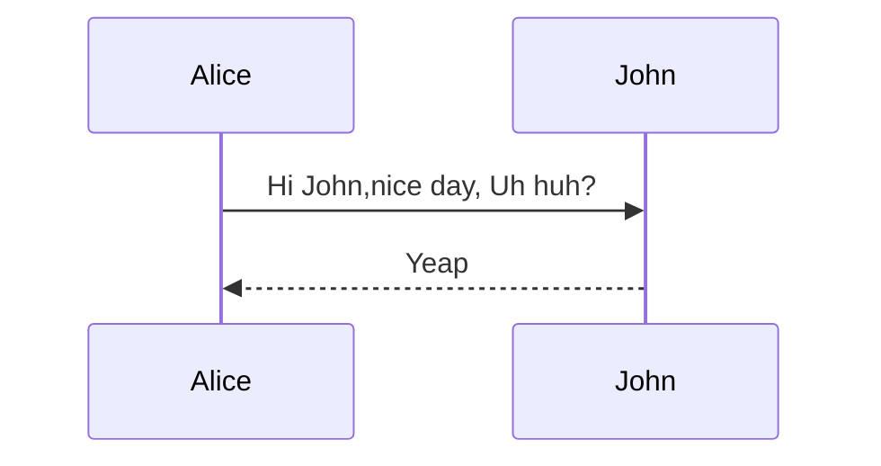

## 小小的一个demo

<div class="mermaid">
	sequenceDiagram
		Alice ->> John: Hi John,nice day, Uh huh?
		John  -->> Alice: Yeap
</div>

## 基本概念
- participant(参与者,先定义的会先现实出来)
- alice(别名，参与者可以起别名,定义别名后，就只能用别名了,如果混用，会是两个参与者）
- message(消息，[participant][arrow][participant]:Message text)
- activation(激活，可对参与者进行激活和去激活，可以重复进行）
	- activate/deactivate [participant] 激活或取消
	- \-\-\>+  加号激活
	- \-\-\>-  减号取消,通过+/-明显比较方便
- note(便签, Note [right of | left of | over] [participant])
	- Note right of John: Foo12345
	- Note left of Alice: An note
	- Note over Alice,John: Cross the world
- loop(循环)
- alt(分支，选择,相当于 if else )
- opt(可选，相当于 if)
```
sequenceDiagram
	participant John
	participant A as  Alice
	A ->> John : Hi,John
	Note left of John: Foo12345
	John  -->> A: Alice..I
	Note right of A : An note
	activate A
	A ->>+ John :  1
	John -->> A : 2
	deactivate A
	A -x- John : 3
	John --x A :4 
	loop Every 30 seconds
		John -->> A : heart bits
		A -->> John : ACK
	end
	A ->> John : Are you ok?
	alt is ok
		John -->>A: Ok啊
	else so so 
		John -->>A: 还活着
	else
		John -->>A: 还不错
	end
	Note over A, John: Over!
```
<div class="mermaid">
	sequenceDiagram
		participant John
		participant A as  Alice
		A ->> John : Hi,John
		Note left of John: Foo12345
		John  -->> A: Alice..I
		Note right of A : An note
		activate A
		A ->>+ John :  1
		John -->> A : 2
		deactivate A
		A -x- John : 3
		John --x A :4 
		loop Every 30 seconds
			John -->> A : 还在么？(heart bits)
			alt is ok
				A ->> John : 在呢，我还在，莫担心
			else  没反应
				John -->> John : Alice is lose,释放他的资源
			end
		end
		A ->> John : Are you ok?
		alt is ok
			John -->>A: Ok啊
		else so so 
			John -->>A: 还活着
		else
			John -->>A: 还不错
		end
		opt 心情好
			A -->> Tom : 出来撸串
		end
		Note over A, John: Over!
</div>

|---
| 箭头类型 | 描述
|:-|:-
| -> | 实线无箭头
| \-\-> | 点线无箭头
| \-\>\> |实线有箭头
| \-\-\>\> |点线有箭头
| \-x | 实线带叉和箭头
| \-\-x| 点线带叉和箭头
|===


### 微信支付流程

```mermaid
	sequenceDiagram
		participant User
		participant WechatApp
		participant MB as MerchantBackend
		participant WPS as WechatPaySystem
		
		MB ->> MB:1.生成图文信息链接或二维码
		MB -->>+ User :展示给用户
		User->>+ WechatApp:2.点击链接或扫描二维码在微信浏览器打开商户H5网页
		WechatApp ->+ MB:网页内请求生成订单
		MB ->>+ MB:4.生成商户订单
		deactivate MB
		MB ->>+ WPS:5.调用统一下单API
		WPS ->>+ WPS:生成预付单
		deactivate WPS
		WPS -->> MB:返回预付单信息(prepay_id)
		deactivate WPS
		WPS -->> MB:返回预付单信息(prepay_id)
		MB ->>+ MB:6.生成JSAPI页面调用的支付参数并签名	
		deactivate MB
		MB -->>- WechatApp:返回支付参数(prepay_id.paySign等)
		User ->>+ WechatApp:7.用户点击发起支付
		WechatApp ->>+ WPS: JSAPI接口请求支付
		WPS ->>+ WPS:8.检查参数合法性和授权权限
		deactivate MB
		WPS -->> WechatApp: 返回验证结果，并要求支付授权
		deactivate WPS
		WechatApp ->>+ WechatApp:提示输入密码
		deactivate WechatApp
		deactivate WechatApp
		User ->>+ WechatApp:9.确认支付，输入密码
		WechatApp ->>+ WPS:提交授权
		WPS ->>+ WPS:验证授权
		deactivate WPS
		alt 并行处理
			WPS ->>+ MB:10.异步通知支付结果			
		else
			MB -->> WPS:11.告知微信通知处理结果
			deactivate MB
		else
			WPS -->> WechatApp:12.返回支付结果，并发微信消息提示
			deactivate WPS
		end
		WechatApp -->> User:展示支付信息给用户
		deactivate User
		deactivate WechatApp
		
		WechatApp ->>+ WechatApp: 微信跳转回商户H5页面
		activate WechatApp
		WechatApp ->>+ MB:13.查询商户后台支付结果
		alt 支付结果
			else 未收到支付通知
			MB ->>+ WPS:14.调用查询API，查询支付结果
			WPS -->> MB:返回支付结果
			deactivate WPS
		end
		MB -->> WechatApp:返回支付结果
		WechatApp ->>+ WechatApp:15.商户发货及支付后个性化页面提示
		deactivate WechatApp
		deactivate WechatApp
		deactivate WechatApp

```
<div class="mermaid">
	sequenceDiagram
		participant User
		participant WechatApp
		participant MB as MerchantBackend
		participant WPS as WechatPaySystem
		
		MB ->> MB:1.生成图文信息链接或二维码
		MB -->>+ User :展示给用户
		User->>+ WechatApp:2.点击链接或扫描二维码在微信浏览器打开商户H5网页
		WechatApp ->+ MB:网页内请求生成订单
		MB ->>+ MB:4.生成商户订单
		deactivate MB
		MB ->>+ WPS:5.调用统一下单API
		WPS ->>+ WPS:生成预付单
		deactivate WPS
		WPS -->> MB:返回预付单信息(prepay_id)
		deactivate WPS
		WPS -->> MB:返回预付单信息(prepay_id)
		MB ->>+ MB:6.生成JSAPI页面调用的支付参数并签名	
		deactivate MB
		MB -->>- WechatApp:返回支付参数(prepay_id.paySign等)
		User ->>+ WechatApp:7.用户点击发起支付
		WechatApp ->>+ WPS: JSAPI接口请求支付
		WPS ->>+ WPS:8.检查参数合法性和授权权限
		deactivate MB
		WPS -->> WechatApp: 返回验证结果，并要求支付授权
		deactivate WPS
		WechatApp ->>+ WechatApp:提示输入密码
		deactivate WechatApp
		deactivate WechatApp
		User ->>+ WechatApp:9.确认支付，输入密码
		WechatApp ->>+ WPS:提交授权
		WPS ->>+ WPS:验证授权
		deactivate WPS
		alt 并行处理
			WPS ->>+ MB:10.异步通知支付结果			
		else
			MB -->> WPS:11.告知微信通知处理结果
			deactivate MB
		else
			WPS -->> WechatApp:12.返回支付结果，并发微信消息提示
			deactivate WPS
		end
		WechatApp -->> User:展示支付信息给用户
		deactivate User
		deactivate WechatApp
		
		WechatApp ->>+ WechatApp: 微信跳转回商户H5页面
		activate WechatApp
		WechatApp ->>+ MB:13.查询商户后台支付结果
		alt 支付结果
			else 未收到支付通知
			MB ->>+ WPS:14.调用查询API，查询支付结果
			WPS -->> MB:返回支付结果
			deactivate WPS
		end
		MB -->> WechatApp:返回支付结果
		WechatApp ->>+ WechatApp:15.商户发货及支付后个性化页面提示
		deactivate WechatApp
		deactivate WechatApp
		deactivate WechatApp
</div>


<script src="{{ site.url }}/assets/js/vendor/mermaid.min.js"></script>
